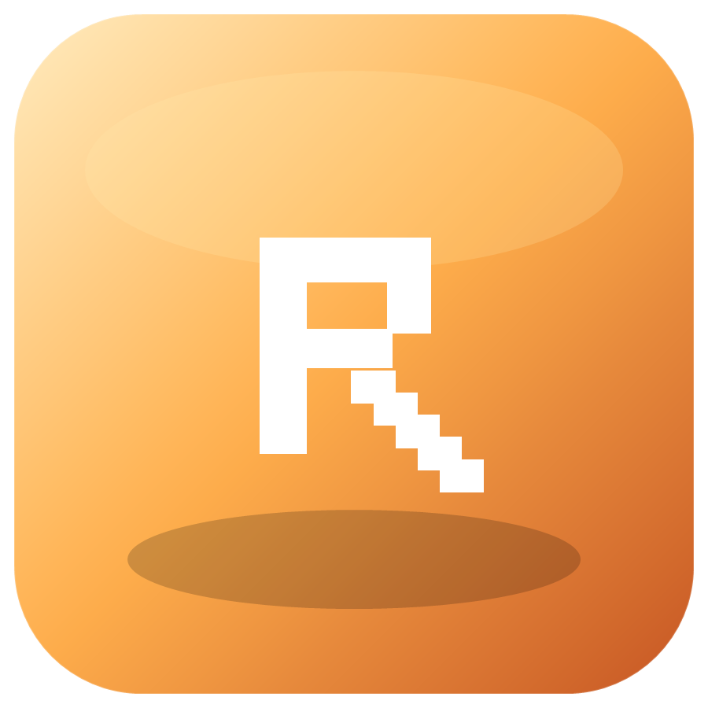
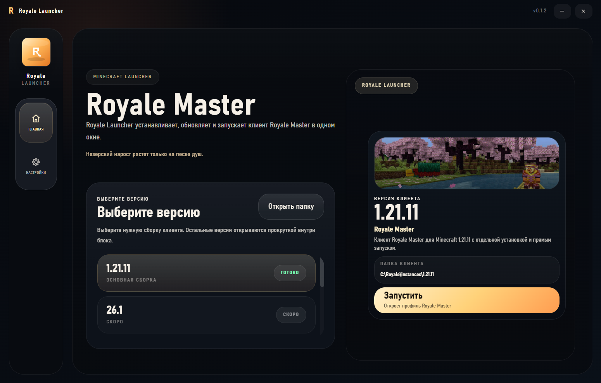
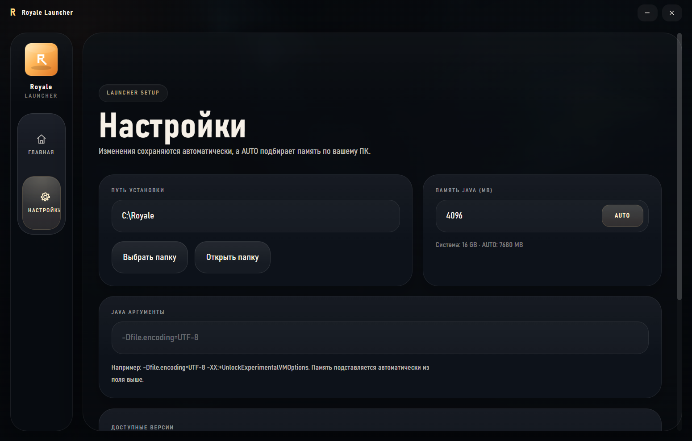

# Royale Launcher

  

  <strong>Royale Launcher</strong> — лаунчер Minecraft для клиента <strong>Royale Master</strong>.

  Устанавливает нужную версию клиента, хранит ее отдельно и запускает из одного окна.

  <a href="https://github.com/SqwaTik/Royale-Launcher/releases/latest">Последний релиз</a>
  ·
  <a href="https://github.com/SqwaTik/Royale-Launcher/releases/latest/download/RoyaleLauncherInstaller.exe">Скачать Installer</a>

## Что это

Royale Launcher создан для тех, кто играет с клиентом Royale Master и хочет держать установку в порядке.

- Показывает доступные версии клиента в одном окне.
- Устанавливает клиент в отдельную папку и не смешивает его с обычной сборкой Minecraft.
- Запускает клиент напрямую.
- Позволяет настроить память Java и дополнительные аргументы запуска.
- Поддерживает режим `AUTO` для подбора памяти под текущий ПК.

## Скриншоты

| Главная | Настройки |
| --- | --- |
|  |  |

## Установка

1. Откройте [последний релиз](https://github.com/SqwaTik/Royale-Launcher/releases/latest).
2. Скачайте `RoyaleLauncherInstaller.exe`.
3. Запустите установщик и выберите ярлык на рабочем столе и в меню Пуск, если они нужны.
4. После установки откройте лаунчер и выберите нужную версию клиента.

## Как начать

1. Откройте `Royale Launcher`.
2. Выберите версию клиента на главной странице.
3. Нажмите `Скачать`, если клиент еще не установлен.
4. После установки нажмите `Запустить`.

## Что можно настроить

- Папку установки клиента.
- Объем памяти Java.
- Автоматический режим памяти `AUTO`.
- Дополнительные Java-аргументы.
- Поведение лаунчера при запуске и закрытии Minecraft.

## Поддержка платформ

- Windows — основной релиз и основной установщик.
- Linux — сборки через CI в форматах `AppImage`, `deb` и `rpm`.
- macOS — сборка через CI в формате `dmg`.

## Royale Master

Royale Master — отдельный клиент Minecraft с модификацией Royale.

Royale Launcher нужен для его аккуратной установки, обновления и запуска без ручной работы с файлами.
